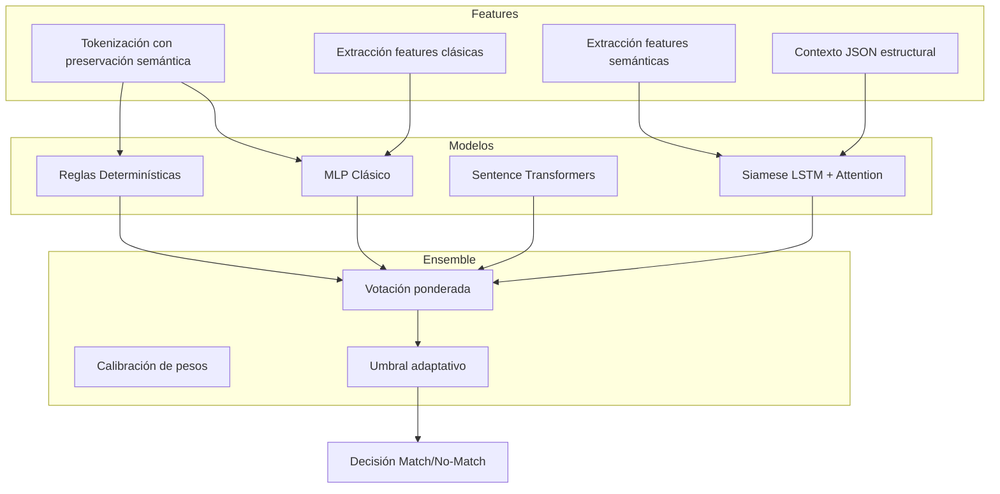

# Semantic Field Mapper

## Arquitectura de Ensemble para Correspondencia Semántica de Campos

### Descripción Técnica

Semantic Field Mapper implementa un sistema de ensemble multicanal para la identificación de correspondencias semánticas entre esquemas de APIs heterogéneas. La arquitectura fusiona tres señales independientes mediante un sistema de votación ponderada con umbral adaptativo, optimizado para escenarios cross-idioma y estructuras JSON anidadas.

### Principios de Diseño

- **Independencia de canales**: Cada componente del ensemble opera sobre representaciones distintas del problema, minimizando la correlación de errores
- **Calibración por umbral**: Los pesos del ensemble y el umbral de decisión se optimizan sobre un conjunto de validación independiente
- **Invarianza lingüística**: La combinación de embeddings multilingües y reglas lingüísticas permite operar sin dependencia de diccionarios bilingües

### Arquitectura del Ensemble

El sistema combina tres predictores especializados:

| Componente | Representación | Técnica | Peso por defecto |
|------------|---------------|---------|------------------|
| Canal Neuronal | Features clásicos + semánticos | MLP con regularización L2 y dropout | 0.45 |
| Canal Semántico | Embeddings multilingües | Cosine similarity sobre sentence-transformers | 0.30 |
| Canal Simbólico | Reglas determinísticas | Token matching + penalizaciones estructurales | 0.25 |

La decisión final sigue: `score_final = Σ(w_i · score_i)` con umbral de activación configurable (default: 0.40).

### Pipeline de Procesamiento



## Extracción de Features
**Features Clásicas (Canal Neuronal)**
**Token Jaccard**: Similitud de conjuntos de tokens con preservación de tokens diferenciadores

**Sequence Similarity:** Distancia de edición normalizada sobre secuencias de tokens

**Penalizaciones estructurales:** Diferencias de longitud, desbalance de tokens

**Match semántico:** Correspondencia de tokens contra índices semánticos precomputados

**Features Semánticas (Canal Siamese)**
Vector de 8 dimensiones por campo:

| Índice | Feature               | Descripción                                                                 |
|--------|----------------------|-----------------------------------------------------------------------------|
| 0      | Token identidad      | Presencia de tokens identificadores (id, rfc, email, uuid)                |
| 1      | Token diferenciador  | Marcadores de subcategoría (primary, billing, shipping)                   |
| 2      | Grupo semántico      | Hash de agrupación semántica precomputada                                  |
| 3      | Confianza de grupo   | Score de pertenencia al grupo semántico                                    |
| 4      | Longitud normalizada | log(|campo| + 1) para manejar campos extensos                              |
| 5      | Ratio vocálico       | count(vowels) / len(campo) como proxy fonético                             |
| 6      | Caracteres especiales| Densidad de separadores y símbolos                                         |
| 7      | Patrón de caso       | One-hot: snake_case, camelCase, PascalCase, UPPER, otros                  |
---
## Contexto JSON (5 features)

| Feature                         | Descripción                                      |
|---------------------------------|--------------------------------------------------|
| Profundidad en el árbol JSON    | Nivel del nodo dentro de la estructura           |
| Indicador de nodo array         | Booleano: indica si el nodo es un array          |
| Indicador de nodo objeto        | Booleano: indica si el nodo es un objeto         |
| Tipo del nodo padre             | Tipo del nodo contenedor                         |
| Posición relativa entre hermanos| Índice relativo dentro del mismo nivel           |

---

## Inferencia sobre Estructuras JSON

El método `predecir_objetos` implementa un algoritmo de *matching óptimo* entre campos de dos objetos JSON utilizando un modelo *ensemble* como función de costo.

### Estrategias disponibles

- **top3**:  
  Para cada campo en A, evalúa los 3 mejores candidatos en B usando una preselección basada en features.

- **completa**:  
  Evaluación exhaustiva `O(n · m)` con poda por umbral inferior.

### Output

- Correspondencias entre campos  
- Scores desglosados por canal  
- Métricas de confianza por campo  

---

## API de Inferencia

```python
from src.training.ensemble_predictor import EnsemblePredictor, EnsembleConfig

# Configuración personalizada
config = EnsembleConfig(
    weight_nn=0.50,
    weight_emb=0.30,
    weight_rules=0.20,
    threshold=0.45
)

predictor = EnsemblePredictor.from_paths(config=config)

# Inferencia par a par
result = predictor.predecir('customer_email', 'email_cliente')

# Matching estructural
mapping = predictor.predecir_objetos(
    api_a={'customer_id': 1, 'billing_address': {...}},
    api_b={'id_cliente': 1, 'direccion_facturacion': {...}},
    estrategia='top3'
)
```

# Estructura del Proyecto
```text
src/
├── config.py                          # Configuración global
├── arq/
│   └── neuron.py                      # Componentes Keras personalizados
├── training/
│   ├── cross_validator.py             # Pipeline de entrenamiento clásico
│   ├── ensemble_predictor.py          # Sistema de ensemble
│   ├── semantic_features_extractor.py # Extractor de features semánticos + contexto
│   ├── train_model.py                 # Orquestador de entrenamiento
│   └── models/                        # Artefactos serializados
├── data_training/
│   ├── gen_datos.py                   # Síntesis de datasets
│   └── datos_entrenamiento.py         # Manejo de datasets
└── db/
    └── config_mongodb.py              # Índices semánticos y tokens
```