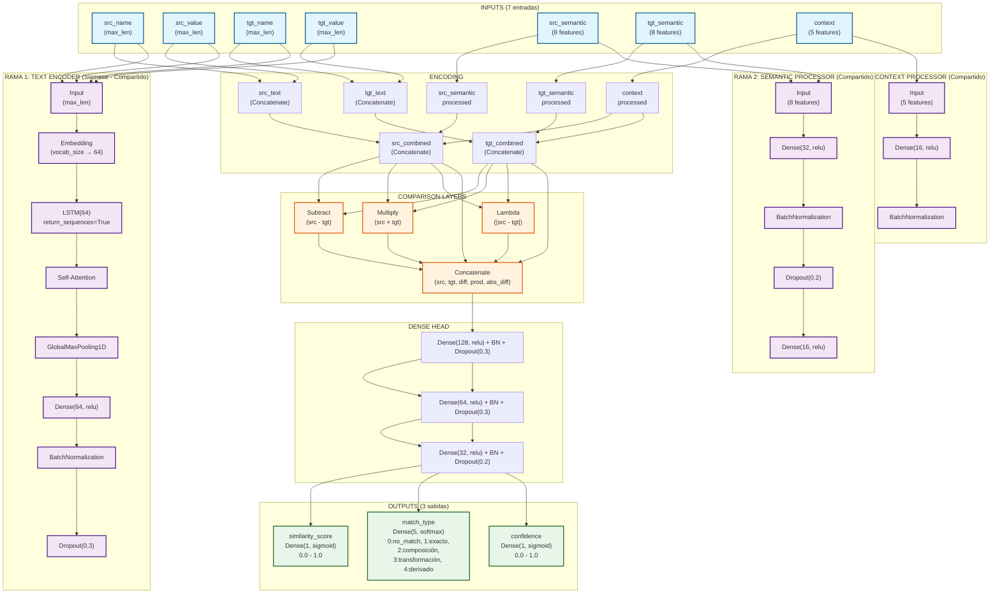

```mermaid
graph TB
    subgraph "INPUTS (7 entradas)"
        SN["src_name<br/>(max_len)"]
        SV["src_value<br/>(max_len)"]
        TN["tgt_name<br/>(max_len)"]
        TV["tgt_value<br/>(max_len)"]
        SS["src_semantic<br/>(8 features)"]
        TS["tgt_semantic<br/>(8 features)"]
        CTX["context<br/>(5 features)"]
    end

    subgraph "RAMA 1: TEXT ENCODER (Siamese - Compartido)"
        direction TB
        TE_IN["Input<br/>(max_len)"]
        EMB["Embedding<br/>(vocab_size → 64)"]
        LSTM["LSTM(64)<br/>return_sequences=True"]
        ATT["Self-Attention"]
        GMP["GlobalMaxPooling1D"]
        D64["Dense(64, relu)"]
        BN["BatchNormalization"]
        DO["Dropout(0.3)"]
        
        TE_IN --> EMB --> LSTM --> ATT --> GMP --> D64 --> BN --> DO
    end

    subgraph "RAMA 2: SEMANTIC PROCESSOR (Compartido)"
        direction TB
        SEM_IN["Input<br/>(8 features)"]
        SD32["Dense(32, relu)"]
        SBN["BatchNormalization"]
        SDO["Dropout(0.2)"]
        SD16["Dense(16, relu)"]
        
        SEM_IN --> SD32 --> SBN --> SDO --> SD16
    end

    subgraph "RAMA 3: CONTEXT PROCESSOR (Compartido)"
        direction TB
        CTX_IN["Input<br/>(5 features)"]
        CD16["Dense(16, relu)"]
        CBN["BatchNormalization"]
        
        CTX_IN --> CD16 --> CBN
    end

    subgraph "ENCODING"
        SRC_ENC["src_text<br/>(Concatenate)"]
        TGT_ENC["tgt_text<br/>(Concatenate)"]
        SRC_SEM_P["src_semantic<br/>processed"]
        TGT_SEM_P["tgt_semantic<br/>processed"]
        CTX_P["context<br/>processed"]
        
        SRC_COMB["src_combined<br/>(Concatenate)"]
        TGT_COMB["tgt_combined<br/>(Concatenate)"]
    end

    subgraph "COMPARISON LAYERS"
        DIFF["Subtract<br/>(src - tgt)"]
        PROD["Multiply<br/>(src × tgt)"]
        ABS_DIFF["Lambda<br/>(|src - tgt|)"]
        MERGED["Concatenate<br/>(src, tgt, diff, prod, abs_diff)"]
    end

    subgraph "DENSE HEAD"
        direction TB
        H128["Dense(128, relu) + BN + Dropout(0.3)"]
        H64["Dense(64, relu) + BN + Dropout(0.3)"]
        H32["Dense(32, relu) + BN + Dropout(0.2)"]
        
        H128 --> H64 --> H32
    end

    subgraph "OUTPUTS (3 salidas)"
        SIM["similarity_score<br/>Dense(1, sigmoid)<br/>0.0 - 1.0"]
        TYPE["match_type<br/>Dense(5, softmax)<br/>0:no_match, 1:exacto,<br/>2:composición,<br/>3:transformación, 4:derivado"]
        CONF["confidence<br/>Dense(1, sigmoid)<br/>0.0 - 1.0"]
    end

    %% Conexiones
    SN & SV --> SRC_ENC
    TN & TV --> TGT_ENC
    SS --> SRC_SEM_P
    TS --> TGT_SEM_P
    CTX --> CTX_P
    
    SN --> TE_IN
    SV --> TE_IN
    TN --> TE_IN
    TV --> TE_IN
    SS --> SEM_IN
    TS --> SEM_IN
    CTX --> CTX_IN
    
    SRC_ENC & SRC_SEM_P & CTX_P --> SRC_COMB
    TGT_ENC & TGT_SEM_P & CTX_P --> TGT_COMB
    
    SRC_COMB & TGT_COMB --> DIFF & PROD & ABS_DIFF
    SRC_COMB & TGT_COMB & DIFF & PROD & ABS_DIFF --> MERGED
    MERGED --> H128 --> H64 --> H32
    H32 --> SIM & TYPE & CONF

    %% Estilos
    classDef inputStyle fill:#e1f5fe,stroke:#01579b,stroke-width:2px
    classDef encoderStyle fill:#f3e5f5,stroke:#4a148c,stroke-width:2px
    classDef comparisonStyle fill:#fff3e0,stroke:#e65100,stroke-width:2px
    classDef outputStyle fill:#e8f5e9,stroke:#1b5e20,stroke-width:2px
    
    class SN,SV,TN,TV,SS,TS,CTX inputStyle
    class TE_IN,EMB,LSTM,ATT,GMP,D64,BN,DO,SEM_IN,SD32,SBN,SDO,SD16,CTX_IN,CD16,CBN encoderStyle
    class DIFF,PROD,ABS_DIFF,MERGED comparisonStyle
    class SIM,TYPE,CONF outputStyle
```